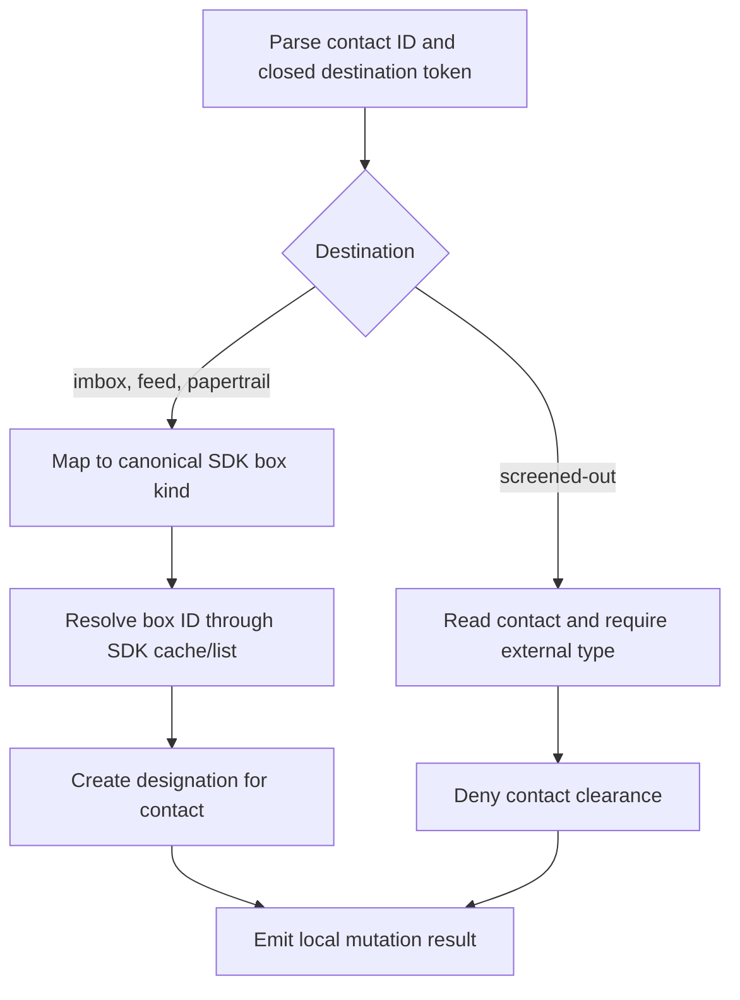

# Contact Delivery Routing - Plan

## Goal Capsule

- **Objective:** A person or agent can set where HEY delivers a contact's future email using the contact ID, without discovering a Screener clearance ID.
- **Means:** Add a narrow `hey contact deliver` mutation backed by HEY's existing designation and contact-clearance operations (KTD1, KTD2).
- **Authority:** Issue #336 and its maintainer clarification define product behavior; this plan defines implementation details; repository instructions and tests govern delivery.
- **Stop conditions:** Stop if the released SDK cannot perform either required mutation, if HEY's accepted destination semantics differ from the issue clarification, or if implementation requires reliable read-back that the API does not expose.
- **Execution profile:** Implement and verify in the isolated feature worktree, then ship through a pull request after review and CI.

---

## Product Contract

### Summary

Add `hey contact deliver <contact-id> --to <destination>` for the four delivery choices HEY exposes on a contact: Imbox, The Feed, Paper Trail, and Screened Out.
The command changes routing through a contact ID and returns a stable mutation result for scripts and agents.

### Problem Frame

HEY's web UI presents delivery as a contact setting, but the CLI currently exposes the nearest workflow through Screener clearance IDs.
That forces callers to translate a contact-level intent into a different resource type and prevents a direct command for future mail routing.

### Requirements

**Command contract**

- R1. `hey contact deliver` accepts exactly one positive contact ID and requires `--to` with one of `imbox`, `feed`, `papertrail`, or `screened-out`.
- R2. Unsupported destinations, missing `--to`, and invalid contact IDs fail with a usage error during Cobra argument validation, before account selection or any other HTTP request.
- R3. Successful machine output contains the contact ID and the normalized public destination; human output confirms the accepted delivery change without exposing designation or clearance terminology.

**Routing behavior**

- R4. `imbox`, `feed`, and `papertrail` resolve the selected account's canonical box by SDK box kind and create the contact designation through the SDK.
- R5. `screened-out` reads the contact through the SDK, rejects contacts that are not external email senders, then updates an eligible contact's clearance to denied without performing box discovery.
- R6. A box selection does not silently approve a contact that is already screened out. Selecting Feed also removes an existing bundle because HEY does not permit Feed-designated contacts to remain bundled; Imbox and Paper Trail preserve eligible bundles.
- R7. The command uses the selected linked-account context consistently with existing direct-ID contact mutations while treating the explicit contact ID as authoritative.

**Documentation and agent access**

- R8. Command help, CLI documentation, API coverage, and the bundled HEY skill describe the same four destinations, contact-ID requirement, external-contact restriction for Screened Out, Feed unbundling side effect, and write-only limitation.
- R9. The bundled skill distinguishes contact IDs from clearance IDs, box item IDs, box IDs, and email addresses, and warns that Screened Out is the deny/blocking choice for external contacts.

### Acceptance Examples

- AE1. Given contact `12345`, when `hey contact deliver 12345 --to feed` succeeds, the CLI resolves the Feed box, creates a designation for contact `12345`, and returns contact `12345` with destination `feed`.
- AE2. Given external contact `12345`, when `hey contact deliver 12345 --to screened-out` succeeds, the CLI reads and confirms the contact is external, denies it without listing boxes, and returns destination `screened-out`.
- AE2a. Given an internal HEY contact, when Screened Out is requested, the CLI rejects the mutation after the contact read and does not create a denied clearance that would have no blocking effect.
- AE3. Given a missing, empty, or unsupported destination, the command returns a usage error and sends no box, designation, or contact-clearance request.
- AE4. Given a valid box destination but a failed box lookup or designation write, the command returns the translated SDK error and emits no success response.

### Scope Boundaries

The command is intentionally one-contact-at-a-time and write-only.
It pre-reads only Screened Out targets to prevent false success for internal HEY contacts; box destinations remain direct writes. It does not otherwise duplicate HEY's mutable delivery state, promise that asynchronous movement of existing mail has completed, or add a client retry around an ambiguous mutation failure.

#### Deferred to Follow-Up Work

- Delivery-setting read-back, designation removal by designation ID, and idempotent state comparison remain in issue #180 until HEY exposes the current designation as structured data.
- Contact autofiling remains in issue #379 and requires separate API and SDK support.
- Contact lookup by email, bulk delivery updates, and TUI delivery controls are outside #336.
- No new MCP operation is needed because this feature is a first-class CLI primitive and the existing MCP catalog already exposes the underlying API operations.

### Sources

- GitHub issue #336 and its maintainer clarification: `https://github.com/basecamp/hey-cli/issues/336`.
- Related designation/read-back scope: `https://github.com/basecamp/hey-cli/issues/180`.
- Related contact autofiling scope: `https://github.com/basecamp/hey-cli/issues/379`.
- Released SDK behavior: `github.com/basecamp/hey-sdk/go/pkg/hey/designations.go`, `github.com/basecamp/hey-sdk/go/pkg/hey/contacts.go`, and `github.com/basecamp/hey-sdk/go/pkg/hey/postings.go` at the version pinned by `go.mod`.
- Server semantics: `app/models/contact/designatable.rb`, `app/models/box/designation.rb`, `app/controllers/boxes/designations_controller.rb`, and `app/controllers/contacts/clearances_controller.rb` in Haystack.

---

## Planning Contract

### Key Technical Decisions

- KTD1. **Keep the destination vocabulary closed.** Parse the four lowercase public tokens before resolution so generic box names, numeric box IDs, SDK kind names, and unsupported boxes do not become accidental compatibility surface. This implements R1-R2.
- KTD2. **Resolve designatable boxes by SDK kind.** Map `imbox`, `feed`, and `papertrail` to the SDK's canonical box kinds, use `Client.BoxIDByKind`, then call `Designations().Create`; this avoids fetching box postings and avoids name-based routing. This implements R4.
- KTD3. **Treat Screened Out as a guarded clearance mutation.** Read the contact with `Contacts().Get`, accept only HEY's external email contactable types (`Alias`, `Person`, and `Service`), then call `Contacts().Screen` with the SDK's denied status while skipping box resolution. This prevents the server's clearance endpoint from reporting success for internal contacts whose mail HEY always approves. This implements R5-R6.
- KTD4. **Construct a local mutation result.** Return the existing contact-mutation shape of `id` plus normalized `destination`, because neither SDK write returns a resource body and the CLI cannot verify current server state. This implements R3.
- KTD5. **Keep contact validation narrow.** Let HEY validate reachability and account ownership, and do not read current clearance or designation state. The Screened Out branch's single contact read exists only to reject contactable types for which a denied clearance has no effect; box destinations preserve existing direct-ID write behavior. This implements R6-R7.

### High-Level Technical Design

The two mutation branches share validation, SDK error conversion, and output formatting but retain separate API semantics.

### Assumptions

- The four exact lowercase destination tokens are the complete public surface for #336; aliases such as `feedbox`, `paper-trail`, display names, and numeric box IDs remain unsupported.
- Box designation does not screen an already denied contact back in; callers must explicitly reverse a Screener decision through the appropriate Screener workflow.
- Existing mail may move asynchronously after a designation change, so success means HEY accepted the mutation rather than all affected postings being visible in the destination immediately.
- Existing direct-ID account behavior is preserved: `--account` scopes SDK requests, while the explicit contact ID determines the contact resource.
- The contact JSON's `contactable_type` remains the structured eligibility signal for Screened Out. `Alias`, `Person`, and `Service` are external email senders; internal and non-email contactable types are rejected locally because HEY's clearance endpoint currently accepts them even though its delivery examiner continues to approve internal contacts.

### Sequencing

Implement the command contract and endpoint tests first, then update every user- and agent-facing contract from that settled vocabulary, and finish with real-server smoke coverage that mutates only a disposable contact.

---

## Implementation Units

### U1. Implement the contact delivery mutation

- **Goal:** Add the command, strict destination parsing, the two SDK mutation branches, stable output, and exhaustive command-level tests.
- **Requirements:** R1-R7; covers AE1-AE4.
- **Dependencies:** None.
- **Files:**
  - `internal/cmd/contacts_deliver.go`
  - `internal/cmd/contacts.go`
  - `internal/cmd/contacts_test.go`
  - `internal/cmd/help_test.go`
- **Approach:**
  1. Register a dedicated contact subcommand using the repository's command-struct pattern, existing `parseContactID`, authentication guard, SDK error conversion, and `writeMutationLine`.
  2. Validate the ID and required closed destination token in the command's Cobra `Args` function, before the root persistent pre-run can select a configured account over HTTP; retain Cobra's required-flag metadata for generated help and surface output.
  3. Parse the destination into a small internal value carrying its public token, display label, and optional canonical box kind per KTD1-KTD3.
  4. Resolve only box destinations through `sdk.BoxIDByKind` and call `sdk.Designations().Create`. For Screened Out, call `sdk.Contacts().Get`, reject any contactable type except `Alias`, `Person`, or `Service`, then call `sdk.Contacts().Screen`.
  5. Return a local `{id, destination}` result and omit reverse breadcrumbs because the prior destination and designation ID are unavailable.
- **Patterns to follow:** `internal/cmd/contacts_bundle.go` for contact mutation structure, `internal/cmd/mutation.go` for output, and the released SDK's `BoxIDByKind`, `DesignationsService`, and `ContactsService` methods.
- **Execution note:** Start with failing request-contract tests for each destination and for zero-request validation failures.
- **Test scenarios:**
  - Covers AE1. Each of `imbox`, `feed`, and `papertrail` resolves the matching box kind, posts the contact ID to the resolved box's designation endpoint, and returns the normalized token.
  - Covers AE2. `screened-out` reads an external contact, sends a denied contact-clearance request, and performs no box-list or designation request.
  - Covers AE2a. `screened-out` rejects `User`, `Extenzion`, tombstone, calendar-only, empty, and unknown contactable types after the contact read and before a clearance request.
  - Covers AE3. Missing `--to`, empty `--to`, an unsupported token, malformed contact ID, zero, and a negative ID each fail before any HTTP request, including when an explicit configured account would otherwise trigger account selection.
  - Covers AE4. A box-list failure, missing canonical box, designation failure, and clearance failure each return a translated error and no success envelope.
  - A box with a misleading display name is selected by kind rather than name.
  - Command help and documentation disclose that selecting Feed removes an existing bundle, while the CLI sends no separate unbundle request.
  - Machine output contains only the numeric ID and canonical destination; styled output uses fixed labels and remains one sanitized line.
  - Contact help names all four tokens, says the command takes a contact ID, and does not expose `designation` or `clearance` as user-facing concepts.
- **Verification:** The real Cobra command tree produces the expected HTTP method, path, body, request order, result shape, summary, and errors for every branch.

### U2. Publish the CLI and agent contract

- **Goal:** Make the new action discoverable and keep help, docs, API inventory, command surface, and embedded skill aligned.
- **Requirements:** R8-R9.
- **Dependencies:** U1.
- **Files:**
  - `.surface`
  - `docs/cli.md`
  - `API-COVERAGE.md`
  - `skills/hey/SKILL.md`
  - `skills/embed_test.go`
- **Approach:**
  1. Regenerate the additive surface entries for the command and `--to` flag.
  2. Add a realistic CLI example and behavioral explanation covering the exact destinations, Imbox reset semantics, the Feed unbundling side effect, the external-contact restriction and safety semantics of Screened Out, asynchronous existing-mail movement, and the write-only boundary.
  3. Record the designation POST and contact-clearance PATCH in API coverage without conflating contact IDs with clearance IDs.
  4. Update the skill's quick reference, decision tree, contact examples, and contact semantics, then pin the critical command and ID guidance in the embedded-skill test.
- **Patterns to follow:** Existing Contacts and Screener sections in `docs/cli.md` and `skills/hey/SKILL.md`; `internal/cmd/surface_test.go` for surface generation.
- **Test scenarios:**
  - The surface snapshot includes `hey contact deliver` and `hey contact deliver --to` with no removals.
  - The embedded skill test finds the exact command, all four tokens, contact-ID guidance, the Feed unbundling warning, and the external-contact Screened Out warning.
  - The contact help terminology test continues to reject internal server terms while recognizing delivery as a contact capability.
- **Verification:** A reviewer can derive the same command syntax, accepted values, safety boundary, and unsupported operations from `--help`, `docs/cli.md`, and the bundled skill.

### U3. Add real-server smoke coverage

- **Goal:** Verify that a built CLI can submit every supported delivery mutation through HEY's live development API without relying on unavailable read-back.
- **Requirements:** R1-R5, R8; covers AE1-AE3.
- **Dependencies:** U1, U2.
- **Files:**
  - `tests/smoke/contacts_test.go`
- **Approach:** Add delivery mutations to the disposable contact lifecycle using the strict-aware contact write helper; assert the local result after each accepted mutation and retain existing hide cleanup without claiming that it removes routing state.
- **Patterns to follow:** `contactWriteJSON`, `skipf`, unique `@example.com` contact data, and lifecycle cleanup in `tests/smoke/contacts_test.go`.
- **Test scenarios:**
  - A disposable external contact can be set to Paper Trail, Feed, Imbox, and finally Screened Out, with each response returning the contact ID and normalized destination.
  - Missing and unsupported destination values fail through the smoke validation test.
  - Server-side unavailability skips in ordinary smoke mode and fails under `HEY_SMOKE_STRICT=1` through the existing helper.
- **Verification:** The smoke module compiles, and strict smoke execution against the HEY development server proves each mutation endpoint accepts the command contract without asserting asynchronous mailbox movement.

---

## Verification Contract

| Gate | Scope | Done signal |
|---|---|---|
| `gofmt` / formatting check | Changed Go files | No formatting diff remains. |
| `go test ./internal/cmd` | Command, help, output, surface, and HTTP contracts | All command tests pass, including new destination and failure cases. |
| `go test ./skills` | Embedded agent guidance | Skill-content assertions pass. |
| `go test -c` in `tests/smoke` | Smoke suite compilation | The separate smoke module compiles against the built command surface. |
| `make test` | Full repository behavior | All unit and integration tests pass. |
| `make lint` | Go and repository lint rules | Lint completes without findings. |
| `make build` | Shippable binary | `./bin/hey` builds successfully. |
| `make test-smoke` with strict mode when the development server is available | Real HEY API acceptance | Every contact-delivery write passes without a strict-aware skip. |

---

## Definition of Done

- U1-U3 are implemented with their listed test scenarios passing.
- The command accepts only the four documented destinations and sends the correct SDK operation for each branch.
- Invalid input fails before account-selection HTTP traffic; failed reads or writes never emit a success response or send a follow-on mutation.
- Help, `docs/cli.md`, API coverage, `.surface`, and the embedded HEY skill agree on syntax, IDs, Feed unbundling, Screened Out eligibility and safety, and limitations.
- The full test, lint, and build gates pass; smoke coverage compiles and runs strictly when the development server is available.
- The pull request links and closes #336, names #180 and #379 as related deferred work, and reports the absence of another open PR in this blast area.
- Experimental or abandoned code is removed from the final diff.
